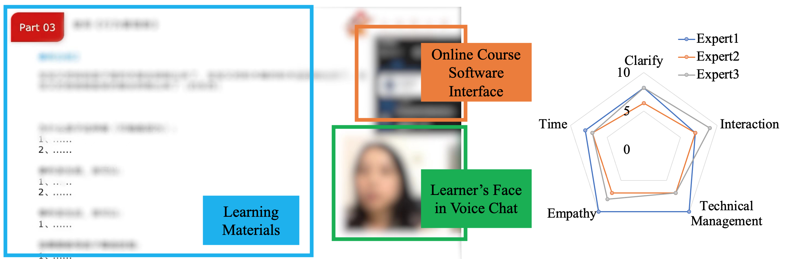

# A Multimodal Framework for Automated Online Course Teaching Quality Assessment

This is a repository for *A Multimodal Framework for Automated Teaching Quality Assessment of One-to-many Online Instruction Videos*。

## Screenshot example

* A screenshot of video.

## Audio examples

| Audio clip    | Score  | Download link|
|  ----  | ----  | ----  |
| 1 | 3,3,3,3,3 |[here](file/DEMO_0_33333.wav)|
| 2 | 2,2,3,3,3 |[here](file/DEMO_1_22333.wav)|
| 3 | 2,2,3,3,3 |[here](file/DEMO_2_22333.wav)|
| 4 | 1,2,1,2,3 |[here](file/DEMO_3_12123.wav)|

    
    
## Codes
Will be published soon.

